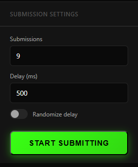
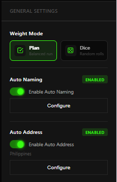
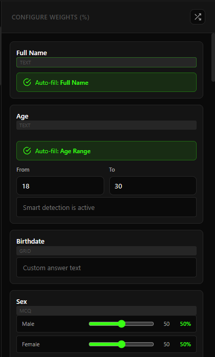
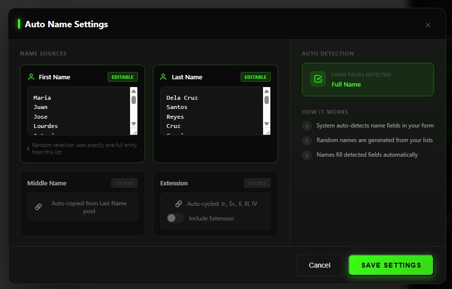
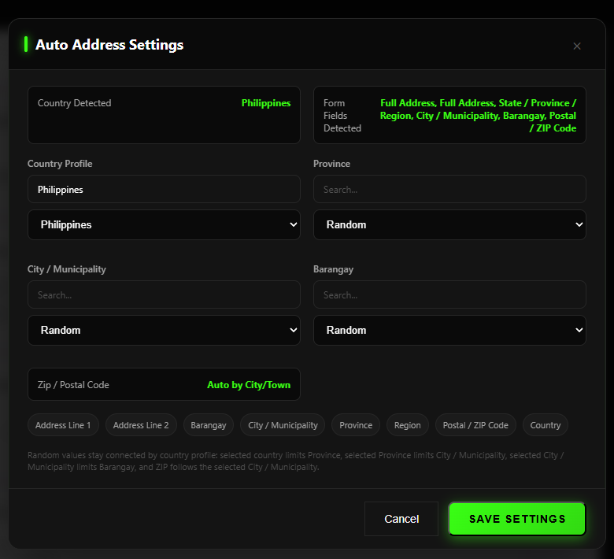
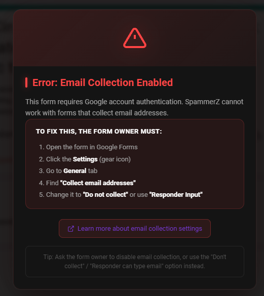
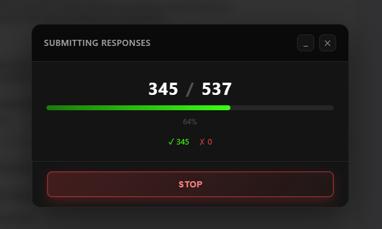

# SpammerZ

> Bulk submit Google Forms with random answers. Serverless Chrome extension.


---

## Installation

### Prerequisites

First, install Git using Windows Package Manager:

```powershell
winget install --id Git.Git -e --source winget
```

After installation, **restart your terminal** to ensure Git is available.

### 1. Clone the Repository

```bash
git clone https://github.com/ZheyUse/gspammerz.git
```

### 2. Load in Chrome

1. Open Chrome and go to `chrome://extensions/`
2. Enable **Developer mode** (toggle in top right)
3. Click **"Load unpacked"**
4. Select the `spammerz` folder
5. The extension is ready!

### 3. (Optional) Pin the extension

Click the puzzle piece icon in Chrome's toolbar → find SpammerZ → click the pin icon to keep it visible.

---

## What is SpammerZ?

SpammerZ is a Chrome browser extension that automates Google Form submissions. It parses any public Google Form, lets you configure answer randomization, and submits hundreds of responses automatically.

**Completely serverless** — all processing happens in your browser. No accounts, no credits, no subscriptions.

---

## Features

SpammerZ is a full automation suite, not just a bulk submitter. It blends smart detection, weighted randomization, and live DOM filling so you can configure a form once and run clean batches fast.

### Core Capabilities

- **No server needed** — runs entirely in your browser
- **Reliable parsing** — extracts form data from Google's own internal JSON (FB_PUBLIC_LOAD_DATA_)
- **All question types** — short text, paragraph, multiple choice, checkbox, dropdown, linear scale, date, time, grid, checkbox grid
- **State persistence** — remembers your settings across sessions

### Smart Detection + Autofill

- **Smart detection engine** — auto-detects name, address, nationality, and survey intent fields
- **Context-aware detection** — intelligently distinguishes between similar terms (e.g., "work flexibility comments" is NOT occupation, but "What is your occupation?" IS)
- **Gender / sex detection** — detects gender/sex questions and lets you control the answer pool
- **Age detection** — auto-fills age fields with configurable min/max range
- **Smart survey answers** — context-aware values for common patterns: email, phone, birthdate, date, school, course/strand, year level, occupation, religion, household size, consent/eligibility, nationality, ethnicity, ancestry
- **Auto name generator** — full name patterns, first/middle/last/MI, extension support, and uppercase-aware output
- **Auto address generator** — country-aware address profiles with region/city/barangay/zip and dependent location fields
- **Auto nationality generator** — detects nationality, citizenship, ethnicity, and ancestry fields with pool-based generation (200+ nationalities)
- **Auto country detection** — infers country from form fields and detected location data
- **Dynamic address modal** — country profiles, cascading region/city/dependent fields, live zip previews, and search-filtered dropdowns
- **Email collection detection** — warns when forms have "Collect email addresses" enabled and blocks submissions to prevent 400 errors

### Name Detection Patterns

Context-aware name field detection that distinguishes person names from other "name" mentions:
- **Detected**: "Name of the Participant", "Name of Student", "Your name", "Complete name", "Full name"
- **Filtered out**: "Company name", "Product name", "File name", "Event name", "Account name", "Network name"
- Also detects: "First name", "Last name", "Middle name", "Middle Initial", "Extension" (Jr., Sr., II, III, etc.)

> Tip: When extension is detected but disabled, the UI shows a red warning badge prompting you to enable it.

### Date Detection

- **Birthdate** — "Birthday", "Birthdate", "Date of Birth", "DOB"
- **Generic date** — Detects native Google Forms date pickers and fills with today's date

### Profession / Work Detection

Auto-detects occupation fields and generates realistic professions. Uses context-aware detection to avoid false positives like survey questions mentioning "work":
- "What is your occupation?" → Detected as occupation ✓
- "Comments about work flexibility" → NOT occupation (false positive) ✓
- Uses an extensive profession database (720+ jobs including Doctor, Engineer, Teacher, etc.)

### Course / Strand Detection

Auto-detects education fields:
- **Senior High** — "STEM", "HUMSS", "ABM", "GAS", "TVL"
- **College** — "BS Information Technology", "BS Psychology", "BS Nursing", and 440+ more courses

### Weights, Sliders, and Randomization

- **Slider-based weighting** — per-option sliders with live percentage readout and total weight summary
- **Two weighting modes** — Plan (pre-calculated distribution) or Dice (independent random rolls)
- **Randomize weights** — flexible randomization options:
  - **Randomize All** — one-click random weights for all questions
  - **Per-section randomizer** — grouped by form page/section, randomize weights within each section
  - **Per-question randomizer** — individual randomize button for each question's weights
- **Uniform or weighted picks** — supports classic random or strict weighting per question

### Submission Experience

- **Configurable delay** — base delay with optional jitter (±50%) to mimic human pacing
- **Live progress modal** — realtime submitted/succeeded/failed counters
- **Minimized progress pill** — keep progress visible while working
- **Stop anytime** — halt submissions mid-run with a single click
- **Enable/Disable toggle** — hide the UI to use the form normally
- **High-volume runs** — scale submissions up to 10,000 per run

---

## Data Sources

SpammerZ uses curated local data files for realistic name and profession generation:

| Category | Source | Count |
|---|---|---|
| First Names (Filipino) | `Names/FirstName/firstname.md` | 1,144 names |
| Last Names (Filipino) | `Names/LastName/lastname.md` | 355 surnames |
| Courses / Strands | `options/courses.md` | 441+ options |
| Professions | `options/profession.md` | 721 jobs |

---

## How to Use

### 1. Open a Google Form

Navigate to any **public** Google Form. Private forms (requiring login) cannot be parsed.

### 2. Workspace UI Appears

The form loads with SpammerZ's workspace:

- **Left** — Submission & General settings
- **Middle** — Live Google Form (real DOM)
- **Right** — Configure Weights (%)

### 3. Configure Answers

For each question:

- **Checkboxes / MCQ / Dropdown / Scale**: Set weight percentages
- **Sliders** control selection weight per option

### 4. Set Submission Settings

- **Submissions** — How many responses to submit (default: 100)
- **Delay (ms)** — Wait time between submissions (default: 500ms)
- **Randomize delay** — Add ±50% jitter to prevent rate limiting

### 5. Click "Start Submitting"

- Progress modal shows live counter
- Click **Stop** to cancel mid-run
- Use **_** to minimize into a floating pill
- Completion dialog shows results and lets you submit again

### 6. Disable When Not Needed

Click the **✕ button** in the top-right header to disable. The workspace hides and you can use the form normally. Click the floating **⚡ SpammerZ** button to re-enable.

---

## Screenshots

### Submission Settings



### General Settings



### Configure Weights



### Auto Name Settings



### Auto Address Settings



Context-aware address detection that distinguishes address-related fields from similar terms:
- **Detected**: "Your address", "Home address", "Current address", country/city/zip with possessive
- **Filtered out**: "Country of birth" (→ nationality), "Favorite city", "City of birth", "ZIP code of an area"

### Email Collection Enabled Detection



### Submitting Responses



---

## Privacy

SpammerZ:
- Operates entirely in your browser
- Does NOT send data to any server (except your form submissions to Google)
- Does NOT track or log your submissions
- Does NOT require any permissions beyond what's necessary

Your submissions go directly to Google Forms' servers, just like a normal form submission.

---

## Known Limitations

| Issue | Details |
|---|---|
| Private forms | Cannot parse forms that require login |
| reCAPTCHA | Detected forms may block submissions |
| No-cors responses | Cannot confirm 100% if submission succeeded |
| Rate limiting | Google may throttle rapid submissions |
| Email collection enabled | Forms with "Collect email addresses" will return 400 errors — SpammerZ detects and warns about this |

### Resolving "Email Collection Enabled" Errors

When a form has **"Collect email addresses"** enabled, Google requires authentication and submissions will fail with a 400 error. SpammerZ now:

1. **Detects** when email collection is enabled on form load
2. **Shows a blocking modal** explaining the issue
3. **Blocks the Start button** while email collection is active
4. **Shows a warning banner** during submissions if failures occur

**To fix**: The form owner must disable "Collect email addresses" in Google Forms → Settings → General, or change it to "Do not collect" or "Responder Input".

---

## Colors / Theme

| Element | Color |
|---|---|
| Background | `#000000` (black) |
| Accent | `#39ff14` (neon green) |
| Text | `#ffffff` (white) |

---

## File Structure

```
spammerz/
├── manifest.json              ← Chrome extension config
├── content/
│   └── content.js             ← Main logic (all-in-one)
├── ui/
│   ├── panel.js               ← UI components
│   └── panel.css              ← Dark neon styling
├── Names/
│   ├── FirstName/
│   │   └── firstname.md       ← Filipino first names
│   └── LastName/
│       └── lastname.md        ← Filipino last names
├── options/
│   ├── courses.md             ← Courses/strands list
│   └── profession.md           ← Professions list
├── background/
│   └── service-worker.js      ← Background persistence
└── icons/
    ├── icon16.png
    ├── icon48.png
    └── icon128.png
```

---

## Troubleshooting

### UI not appearing?
1. Make sure the form is public
2. Check Chrome DevTools console (`F12`) for errors
3. Reload the extension in `chrome://extensions/`

### Submissions not going through?
1. Increase delay to 2000-3000ms
2. Wait 15-30 minutes (Google may have rate limited your IP)
3. Make sure the form is public

### Error: "Could not parse form"
- The form may require login (not public)
- Try opening the form in an incognito window

---

## Share With Friends (No Store)

### Option A: Load Unpacked (Recommended)
1. Zip the extension folder (the one containing `manifest.json`)
2. Your friend unzips it locally
3. Open `chrome://extensions`
4. Enable **Developer mode**
5. Click **Load unpacked** and select the folder

### Option B: Pack as CRX
1. Open `chrome://extensions`
2. Enable **Developer mode**
3. Click **Pack extension**
4. Select the extension folder (with `manifest.json`)
5. Leave **Private key** blank the first time

Chrome will generate:
- `spammerz.crx` (share this)
- `spammerz.pem` (private key, keep safe)

Install on another machine:
1. Open `chrome://extensions`
2. Enable **Developer mode**
3. Drag the `.crx` onto the page

Note: Some Chrome versions block CRX installs unless allowed by policy. If blocked, use **Option A**.

---

## License

MIT — Do whatever you want with it.

---

## Credits

Built with vanilla JavaScript, HTM, and dark neon aesthetics.